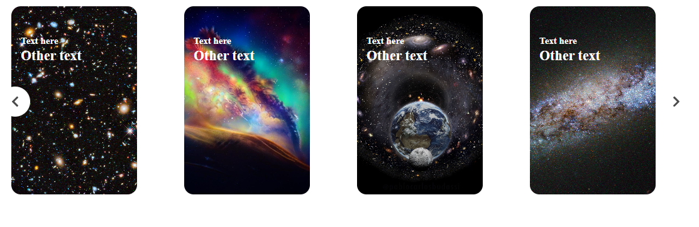

# Carousel Simple

Carousel simple  with only hmtl , css and js , of different images that you can see the following images on the right button as well as on the left button until you reach the end or the beginning.

  

There is another form of carousel that is of infinite form where if it is given right or left it turns around seeing all the images without an end using "carousel-infinite.js".

